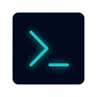

  
  <h1>AzFree Megathread</h1>
  
<strong>Azərbaycanın ən etibarlı və hərtərəfli rəqəmsal resurs kataloqu (FMHY Alternativi)</strong>

  
  
  [-success)](#)
  

## 📌 Layihə Haqqında (About)
**AzFree**, rəqəmsal dünyada (oyunlar, filmlər, proqram təminatı və təhsil resursları üzrə) təhlükəsiz, yoxlanılmış və pulsuz mənbələrin tək bir ünvanda toplandığı **açıq mənbəli (open-source) megathread** platformasıdır. Bizim əsas məqsədimiz istifadəçiləri zərərli proqramlardan (malware), viruslu torrentlərdən və keyfiyyətsiz "fake" saytlardan qorumaqdır.

## 🚀 Xüsusiyyətlər (Features)
- 🔒 **Yoxlanılmış Mənbələr:** Təqdim edilən bütün mənbələr təhlükəsizlik testindən keçirilir.
- ⚡ **PWA Dəstəyi (Tətbiq kimi yükləmə):** Həm mobil, həm PC-də birbaşa proqram kimi yüklənə bilir.
- 🔎 **Ağıllı Axtarış:** Fuse.js ilə təchiz edilmiş sürətli axtarış sistemi (`Ctrl+K`).
- 🎨 **Müasir UI (Glassmorphism):** TailwindCSS ilə işlənmiş "Dark Mode" premium interfeys.
- 🏷 **Dinamik İdarəetmə & Upvote:** Reytinq vermə sistemi, dil bayraqları və məzmun kateqoriyalaşdırması.

## 🗂 Mövcud Kateqoriyalar
- 🎬 **Filmlər və Seriallar:** Ən yaxşı "Streaming" və "Torrent" saytları (Az, TR, RU, EN).
- 🎮 **Oyunlar:** Təhlükəsiz "Repack"-lər, Emulyatorlar və "Direct Link" mənbələri.
- 💻 **Proqram Təminatı:** Etibarlı, Açıq mənbəli (FOSS) və faydalı alternativlər.
- 📚 **Təhsil:** Pulsuz onlayn kurslar və ədəbiyyat resursları.

## 🛠 Texnologiya Yığını (Tech Stack)
- **Languge:** Vanilla HTML5, CSS3, ES6+ JavaScript
- **Styling:** Tailwind CSS (CDN/Custom config)
- **Search System:** Fuse.js (Asinxron axtarış)
- **Iconography:** Google Material Icons Round 

## 🤝 Töhfə Verin (Contribute)
Siz də yeni etibarlı saytlar təklif edə və ya "AzFree" layihəsinin inkişafına kömək edə bilərsiniz. Daha ətraflı məlumat üçün [CONTRIBUTING.md](CONTRIBUTING.md) faylımıza göz atın. Xahiş edirik reklam məqsədli və yoxlanılmamış linkləri paylaşmaq barədə Pull Request atmayın.

## ⚖️ Hüquqi Xəbərdarlıq (Disclaimer & License)
AzFree serverlərində heç bir pirat/qeyri-qanuni fayl **SAXLANILMIR**. Layihə yalnız internetdəki mövcud olan ictimai və faydalı informasiyaları bir araya toplayan **kataloq və məlumat portalı** (megathread) missiyasını daşıyır. 
 
Layihə **MIT Lisenziyası** altında fəaliyyət göstərir.

   
  <i>Designed & Developed with 🤍 by <b>KodAura Studio / CyberSweepX</b></i>

